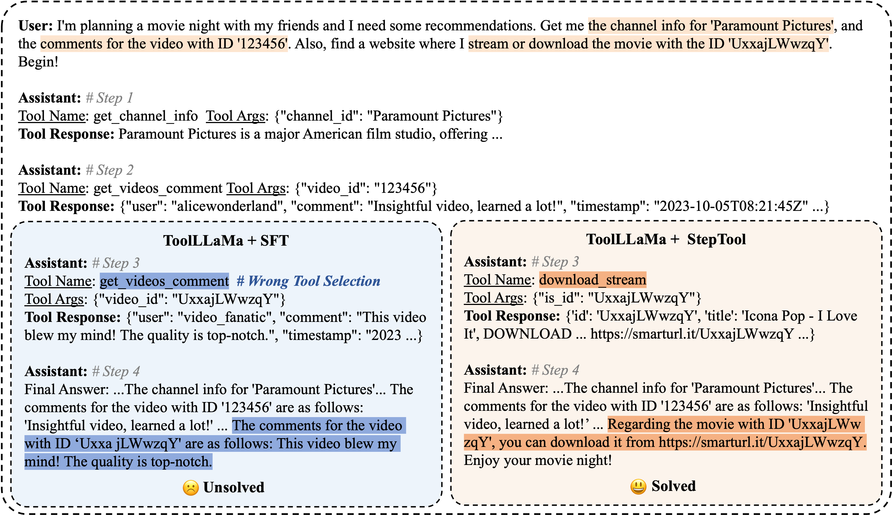
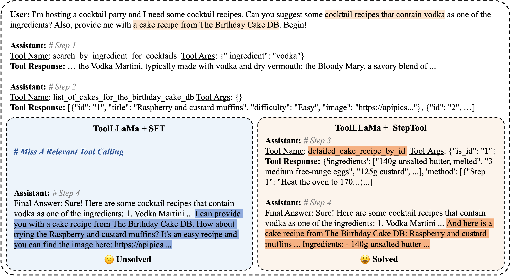
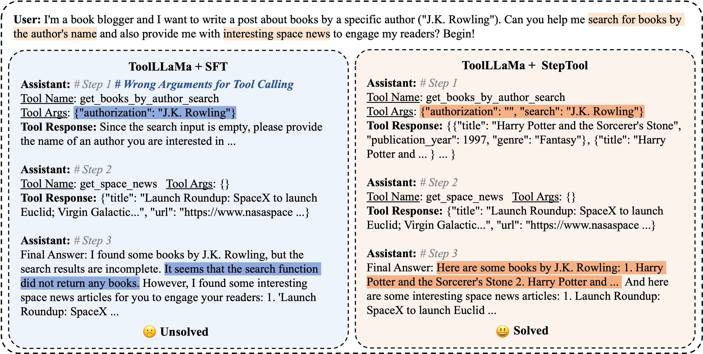

# Codes for StepTool

## 0. Environment Setup

1. Create a new Conda environment:

    ```bash
    conda create -n steptool python=3.10
    ```

2. Activate the environment:

    ```bash
    conda activate steptool
    ```

3. Install [Pytorch](https://pytorch.org/get-started/locally/) and other required dependencies via `pip`:

```bash
    pip install torch torchvision torchaudio
    pip install -r requirements.txt
```
**Note**: Ensure that the version of GCC/G++ is >= 9.0.0.


## 1. Step-grained Data Construction

Step-grained rewards can be assigned using various methods, including automated rule-based systems, human annotations, or advanced models such as GPT-4.

Below is a reference prompt for GPT-4 to perform step-grained reward annotation:
```
Query:
{query}

Intermediate Steps:
{mid_steps}
Final Answer:
{final_answer}

Given the above query, all intermediate steps and the final answer, you need to evaluate the entire task-solving process by following rules:
(1) **Successful Tool Calling:** For each intermediate step, determine if a tool was called successfully and give a score of 0 (no) or 1 (yes).
(2) **Contribution to Final Answer:** For each intermediate step, rate its contribution to the final answer on a scale from 0 to 5.
(3) **Final Answer Status:** Determine if the final answer is 'Solved',  'Unsure', or 'Unsolved'.

Now provide your evaluation in JSON format with the parameters of 'succeed_tool_calling', 'contribution_to_final_answer' and 'final_answer_status'  to the function `evaluate_process_reward`.
```

We provide a sample training data file, data_train/${MODEL_TYPE}/step_grained_for_ppo_example.csv, for use in the subsequent training phase. 

The complete training dataset can be downloaded from [this Dropbox link](https://www.dropbox.com/scl/fo/faizqka89m4fbz0ukhwai/AEzVegNkK2sOfvUQQOj2uUQ?rlkey=425kosbbbeihewx61bujnop94&st=62zi4jea&dl=0).

## 2. Step-grained Training with PPO

The step-grained training is implemented in `src/steptool/step_ppo.py` and `src/steptool/step_ppotrainer.py`.

1. Configuration

Modify the configuration file `config/${MODEL_TYPE}/StepTool_ppo.json` as needed. The `MODEL_TYPE` can be one of `toollama`, `qwen2`, or `llama3-1`. Here’s an example configuration:

```json
{
    "peft_kwargs": {
        "r": 8,
        "lora_alpha": 16,
        "bias": "none",
        "task_type": "CAUSAL_LM"
    },
    "ppo_kwargs": {
        "learning_rate": 1e-5,
        "log_with": "wandb",
        "remove_unused_columns": false,
        "batch_size": 8,
        "mini_batch_size": 2,
        "gradient_accumulation_steps": 4,
        "kl_penalty": "kl",
        "init_kl_coef": 0.3,
        "target_kl": 6,
        "target": 6,
        "horizon": 10000,
        "gamma": 0.99
    }
}
```

2. Run the scripts

```bash
bash scripts/steptool_train/train_toolllama.sh
bash scripts/steptool_train/train_qwen2.sh
bash scripts/steptool_train/train_llama3-1.sh
```

Example Command (from `scripts/steptool_train/train_toolllama.sh`):

```bash
export PYTHONPATH=./
export TRAIN_PATH="data_train"
export TRAIN_SET="step_grained_for_ppo_example"
export CUDA_VISIBLE_DEVICES="0,1,2,3"

export MODEL_TYPE="toolllama"
# load the base model after sft pretrain
export MODEL_PATH="ToolBench/ToolLLaMA-2-7b-v2"

python src/steptool/step_ppo.py \
    --model_path ${MODEL_PATH} \
    --model_type ${MODEL_TYPE} \
    --config_path config/${MODEL_TYPE}/StepTool_ppo.json \
    --data_file ${TRAIN_PATH}/${MODEL_TYPE}/${TRAIN_SET}.csv \
    --max_context_len 4096 \
    --max_response_len 1024 \
    --epochs 5
```


**Note**, for `qwen2` and `llama3.1`, these models must undergo supervised fine-tuning (SFT) beforehand:

```bash
bash scripts/sft/train_qwen2.sh
bash scripts/sft/train_llama3-1.sh
```

A sample training dataset for SFT is available in `data_train/${MODEL_TYPE}/gpt4_dfs_G123_for_sft_example.json`

## Train Baselines (RFT, PPO, ETO, ArCHer)

### RFT

```bash
bash scripts/baseline-rft/train_rft.sh
```

### PPO (Final Reward)

```bash
bash scripts/baseline-ppo/train_ppo.sh
```

### ETO (DPO)

```bash
bash scripts/baseline-eto/train_dpo.sh
```

### ArCHer

```bash
bash scripts/baseline-archer/build_data.sh
bash scripts/baseline-archer/train_archer.sh
```

## Evaluation on StableToolBench

### 1. Build the api server

To set up the API server, follow the [StableToolBench](https://github.com/THUNLP-MT/StableToolBench) instructions.

First, download a cache from [HuggingFace](https://huggingface.co/datasets/stabletoolbench/Cache) or [Tsinghua Cloud](https://cloud.tsinghua.edu.cn/f/07ee752ad20b43ed9b0d/?dl=1). 

After downloading, unzip the folder into the `stabletoolbench/server` folder and ensure the `server` folder contains `tool_response_cache` folder and `tools` folder. The resulting folder of `server` looks like:
```
├── /server/
│  ├── /tools/
│  │  └── ...
│  ├── /tool_response_cache/
│  │  └── ...
│  ├── config.yml
│  ├── main.py
│  ├── utils.py
```

Next, specify your configurations in `server/config.yml`

```
api_key: 
api_base: 
model: gpt-4-turbo-preview
temperature: 0
toolbench_url: http://8.130.32.149:8080/rapidapi
rapidapi_key: 
tools_folder: "./tools"
cache_folder: "./tool_response_cache"
is_save: true
port: 8081
```

To run the server:
```
cd server
python main.py
```
The server will be run at `http://localhost:{port}/virtual`. 
To use the server, you will further need a toolbench key. You can apply one from this [form](https://forms.gle/oCHHc8DQzhGfiT9r6).

### 2. Run the model using vLLM

We recommend setting up a new Conda environment for vLLM by following the [installation guide](https://docs.vllm.ai/en/latest/getting_started/installation.html)

To build a vLLM server for the `ToolLLaMA-2-7b-v2` model, you can use the following command:
```
python -m vllm.entrypoints.openai.api_server --model ToolBench/ToolLLaMA-2-7b-v2 --served-model-name toolllama --max-model-len=8192 --dtype=bfloat16 --host 127.0.0.1 --port 8083 --rope-scaling '{"type": "linear", "factor": 2.0}'
```

**Note**: If you're using a LoRA version of the model, make sure to merge the LoRA weights with the base model before running it in vLLM.

### 3. Run the Evaluation Scripts

To evaluate the model on `StableToolBench`, first configure `stabletoolbench/config.yml`: 

```
api_key:
api_base:
toolbench_key:
tool_root_dir: server/tools
```

Then, infer the model on the `solvable_test_queries` by running:

```bash
bash scripts_eval/toolllama/inference_toolllama_vllm.sh
bash scripts_eval/qwen2/inference_qwen2_vllm.sh
bash scripts_eval/llama3-1/inference_llama3-1_vllm.sh
bash scripts_eval/baseline-rft/inference_rft_vllm.sh
bash scripts_eval/baseline-ppo/inference_ppo_vllm.sh
bash scripts_eval/baseline-eto/inference_eto_vllm.sh
bash scripts_eval/baseline-archer/inference_archer_vllm.sh
```

Finally, evaluate the `pass_rate` and `win_rate` metrics:

```bash
bash scripts_eval/toolllama/run_convert_answer.sh
bash scripts_eval/toolllama/run_pass_rate.sh
bash scripts_eval/toolllama/run_preference.sh

bash scripts_eval/qwen2/run_convert_answer.sh
bash scripts_eval/qwen2/run_pass_rate.sh
bash scripts_eval/qwen2/run_preference.sh

bash scripts_eval/llama3-1/run_convert_answer.sh
bash scripts_eval/llama3-1/run_pass_rate.sh
bash scripts_eval/llama3-1/run_preference.sh

bash scripts_eval/baseline-rft/run_convert_answer.sh
bash scripts_eval/baseline-rft/run_pass_rate.sh

bash scripts_eval/baseline-ppo/run_convert_answer.sh
bash scripts_eval/baseline-ppo/run_pass_rate.sh

bash scripts_eval/baseline-eto/run_convert_answer.sh
bash scripts_eval/baseline-eto/run_pass_rate.sh

bash scripts_eval/baseline-archer/run_convert_answer.sh
bash scripts_eval/baseline-archer/run_pass_rate.sh
```

## Main Experimental Results in the Paper (Updated in May. 2025)

All results were re-evaluated in May. 2025 to ensure the stability of the \texttt{gpt-4-turbo-2024-04-09} evaluator.

| **Backbone** | **Strategy** | **Method** | **I1. Pass** | **I1. Recall** | **I2. Pass** | **I2. Recall** | **I3. Pass** | **I3. Recall** | **ToolLens Test. Pass** | **ToolLens Test. Recall** |
|-----|-----|-----|---------|---------|---------|---------|---------|---------|---------|---------|
| ToolLLaMA-2-7b-v2 | CoT | SFT | 50.6±1.6 | 0.7952 | 47.1±0.8 | 0.8081 | 40.4±0.8 | 0.6833 | 40.2±0.9 | 0.6769 |
| ToolLLaMA-2-7b-v2 | CoT | RFT | 50.2±1.2 | 0.8061 | 45.9±1.8 | 0.8197 | 38.5±1.2 | 0.7536 | 39.5±0.7 | 0.7323 |
| ToolLLaMA-2-7b-v2 | CoT | PPO (Final Reward) | 50.9±1.0 | 0.8030 | 46.6±2.0 | 0.8185 | 40.2±0.0 | 0.6869 | 39.2±0.1 | 0.6817 |
| ToolLLaMA-2-7b-v2 | CoT | ETO (DPO) | 50.3±0.9 | 0.7874 | 45.9±0.3 | 0.7859 |  38.8±1.0 | 0.7150 | 40.2±0.5 | 0.7176 |
| ToolLLaMA-2-7b-v2 | CoT | ArCHer | 51.8±0.8 | 0.8005 | 47.5±0.6 | 0.8039 | 35.5±2.8 | 0.6907 | 42.8±0.6 | 0.6693 |
| ToolLLaMA-2-7b-v2 | CoT | **StepTool**   |  **61.1±0.7** | **0.8743** | **56.6±2.2** | **0.8992**| **45.9±1.8** | **0.7724** | **47.3±0.4** | **0.7500** |
|-----|-----|-----|---------|---------|---------|---------|---------|---------|---------|---------|
| ToolLLaMA-2-7b-v2 | DFSDT | SFT | 58.7±1.0 | 0.8419 | 54.3±1.1 | 0.8665 | 54.1±1.3 | 0.7331 | 46.6±1.0 | 0.7092 |
| ToolLLaMA-2-7b-v2 | DFSDT | RFT | 55.0±1.6 | 0.8490 | 49.5±0.8 | 0.8531 | 58.5±2.4 | 0.7465 | 41.1±0.5 | 0.7598 |
| ToolLLaMA-2-7b-v2 | DFSDT | PPO (Final Reward) | 59.6±1.1 | 0.8360 | 54.0±1.6 | 0.8709 | 39.9±0.8 | 0.7344 | 42.4±0.5 | 0.7004 |
| ToolLLaMA-2-7b-v2 | DFSDT | ETO (DPO) | 57.1±1.2 | 0.8412 | 54.5±2.1 | 0.8747 | 44.0±2.8 | 0.7298 | 47.9±0.8 | 0.7487 |
| ToolLLaMA-2-7b-v2 | DFSDT | ArCHer | 60.0±1.5 | 0.8491 | 54.5±0.8 | 0.8724 | 53.3±2.0 | 0.7284 | 45.6±0.3 | 0.7207 |
| ToolLLaMA-2-7b-v2 | DFSDT | **StepTool** | **64.1±1.4** | **0.8797** | **60.3±0.9** | **0.9004** | **64.8±2.3** | **0.7831** | **53.2±1.2** | **0.7819** |

## More Cases

<!-- html形式 插入cases/下的图片 -->


